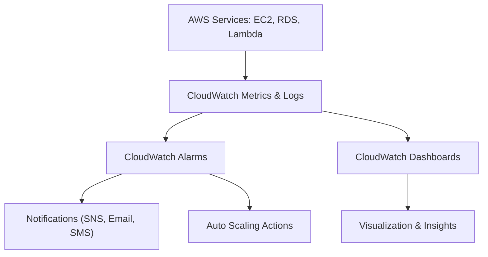

# 📊 **Amazon CloudWatch – **

Amazon **CloudWatch** is a **monitoring and observability service** that provides data and actionable insights for **AWS resources, applications, and services**.  
It helps you **collect metrics**, **monitor logs**, **set alarms**, and **visualize performance** in real time.

---

## ☁️ **1. What is CloudWatch?**

CloudWatch monitors **AWS resources** (like EC2, Lambda, RDS, S3, etc.) and **applications** you run on AWS or on-premises.

It helps you:
- Collect and track **metrics**.
- Monitor **log files**.
- Set **alarms** and **automate responses**.
- Create **dashboards** for visualization.

🧠 **Analogy:** Think of CloudWatch as AWS’s “fitness tracker” — it tells you how healthy and active your AWS environment is.

---

## 🧩 **2. Core Components**

| 🧱 **Component** | 📝 **Description** |
|------------------|-------------------|
| **Metrics** | Time-ordered data points for monitoring performance (e.g., CPUUtilization). |
| **Alarms** | Trigger notifications or actions based on thresholds. |
| **Logs** | Collect, store, and search system/application logs. |
| **Events (EventBridge)** | Detect and respond to changes in your AWS environment. |
| **Dashboards** | Visualize metrics and logs in one place. |
| **Insights** | Analyze log data interactively (CloudWatch Logs Insights). |

---

## ⚙️ **3. Common Use Cases**

- Monitor **EC2 instance performance** (CPU, Disk, Network).
- Track **RDS or Lambda** metrics.
- Store **application logs**.
- Set **alarms** to trigger **SNS notifications** or **Auto Scaling** actions.
- Create **custom dashboards** for real-time visibility.

---

## 🏗️ **4. How CloudWatch Works**

🧠 Flow Summary:

AWS services generate metrics & logs

CloudWatch collects them in near real-time

You define alarms for specific thresholds

Alarms trigger notifications or actions

## 🧰 5. Setting Up CloudWatch Monitoring (Step-by-Step)

🪜 A. Monitor EC2 Instance Metrics

Go to EC2 Console → Instances → Monitoring Tab

Choose “View in metrics” to open CloudWatch directly.

Default metrics include:

CPUUtilization

DiskReadOps / DiskWriteOps

NetworkIn / NetworkOut

StatusCheckFailed

🪜 B. Create an Alarm
aws cloudwatch put-metric-alarm \
  --alarm-name "HighCPUUtilization" \
  --metric-name CPUUtilization \
  --namespace AWS/EC2 \
  --statistic Average \
  --period 300 \
  --threshold 80 \
  --comparison-operator GreaterThanThreshold \
  --dimensions Name=InstanceId,Value=i-0abcd1234efgh5678 \
  --evaluation-periods 2 \
  --alarm-actions arn:aws:sns:us-east-1:123456789012:NotifyMe

🪜 C. View & Visualize Metrics

Go to CloudWatch → Dashboards → Create Dashboard

Choose widgets (Line, Gauge, Number).

Add metrics such as:

EC2 → CPUUtilization

S3 → BucketSizeBytes

Lambda → Invocations, Errors

## 🧭 6. CloudWatch Alarms – Actions

You can configure alarms to:

📩 Send SNS Notifications

🔄 Trigger Auto Scaling

## ⚙️ Perform EC2 Actions (stop/start/terminate)

📡 Send Events to EventBridge

Example – Stop instance on low usage:
aws cloudwatch put-metric-alarm \
  --alarm-name "LowCPUStopInstance" \
  --metric-name CPUUtilization \
  --namespace AWS/EC2 \
  --statistic Average \
  --period 300 \
  --threshold 10 \
  --comparison-operator LessThanThreshold \
  --evaluation-periods 3 \
  --alarm-actions arn:aws:automate:us-east-1:ec2:stop \
  --dimensions Name=InstanceId,Value=i-0abcd1234efgh5678
